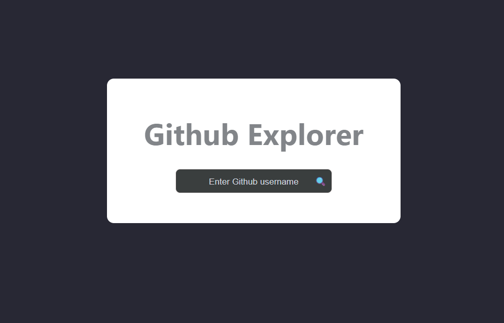
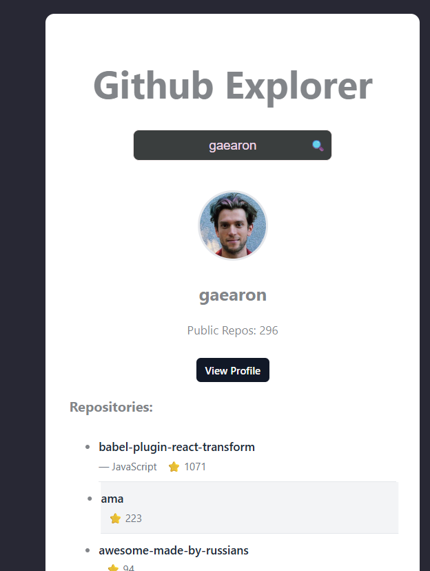

# GitHub Repository Explorer


A **React + TypeScript** application that allows users to search for GitHub users and explore their repositories using the **GitHub REST API**.

---

## 📸 Preview

<p align="center">
  
  
</p>

---

## 🌐 Live Demo

Coming soon...

---

## 🚀 Features

- Search GitHub users
- Fetch and display user profile information
- Fetch and list repositories
- Sort repositories by ⭐ stars
- Loading state handling
- Error handling
- Debounced API requests (500ms)
- Clean UI with hover interactions
- Strong TypeScript typing
- Conditional rendering

---

## 🎯 Purpose of the Project

This project was built to practice building a clean React application that interacts with external APIs.

The goal was to implement real-world frontend concepts such as:

- API integration
- State management
- Custom hooks
- Performance improvements with debounce
- Clean component architecture

---

## 🧠 Technical Concepts Applied

This project demonstrates several important React and frontend engineering concepts:

- `useState` for state management
- `useEffect` for side effects
- Custom React Hooks
- Asynchronous data fetching (`async/await`)
- Debounce implementation
- Conditional rendering
- Virtual DOM & reconciliation
- List rendering with stable keys
- Component separation and clean architecture

---

## 🛠 Tech Stack

- **React**
- **TypeScript**
- **Vite**
- **GitHub REST API**
- **CSS**

---

## 📦 Installation

Clone the repository:

```bash
git clone https://github.com/your-username/github-explorer.git
cd github-explorer
```

Install dependencies:

```bash
npm install
```

Run the development server:

```bash
npm run dev
```

Then open:

```
http://localhost:5173
```
---

## 📂 Project Structure

src
 ├── components
 │   ├── RepoList.tsx
 │   └── UserCard.tsx
 │
 ├── hooks
 │   └── useGitHubUser.ts
 │
 ├── services
 │   └── githubService.ts
 │
 ├── types
 │   └── github.ts
 │
 ├── App.tsx
 └── main.tsx

 ---

## 📖 What I Learned

While building this project I practiced:

Structuring React applications with a clean architecture

Working with external APIs

Managing asynchronous data flows

Improving UI/UX with small interaction details

Writing strongly typed TypeScript components

---

## 📄 License

This project is for educational and portfolio purposes.


